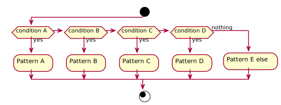

## 定義

WEBサイトのABテストの対象といえば、基本的にユーザーのことを表す。
しかしながら、テスト内容によっては、ユーザーではなく利用ブラウザやデバイスなどシステムや環境を対象にすることもあります。
したがって、ここではABテストの対象のことを「**ターゲット**」と呼ぶことにします。

## A/B/n テストのゴール

A/B/nテストはどのパターンがヒットしても共通の1つのゴールが存在します。
ゴールが1つであることによって、どのパターンが他のパターンよりも優れているかどうかの比較が可能となります。

## ABテストを図で表現する

ABテストは以下のように[アクティビティ図](https://ja.wikipedia.org/wiki/%E3%82%A2%E3%82%AF%E3%83%86%E3%82%A3%E3%83%93%E3%83%86%E3%82%A3%E5%9B%B3)で表現できます。

### ABテストを図に書き起こすときのルール

1. 流入を書く
2. ゴールを書く
3. A/B/nテストの条件は1箇所に集約される
4. A/B/nに分岐した処理はゴールに集約される

### 図に起こす事によって何がわかるか

- ABテスト設計全体を俯瞰できる
- テストの複雑度が把握できる
- 図を用いて関係者と話すことにより、互いの理解度が把握できる
- 図が書けなくない場合、理解していないか、初期設計が複雑すぎるか判断できる

#### 図を書く理由がわからない場合

- 「簡単だから書かない」というのは奢りである。
- 人はテキスト情報より、図のほうが理解度は高い

#### 図が読めない場合

- 初見の場合は読む努力をする
- 図が理解できない場合は質問する

#### ABテストの設計図をテキストで管理する

PlantUML図の[Activity Diagram](https://plantuml.com/en/activity-diagram-beta)記法を利用することで、Git管理できる状態となります。
PlantUMLを試す場合は[PlantUML Editor (beta)](https://plantuml-editor.kkeisuke.com/)で試すことも可能です。

