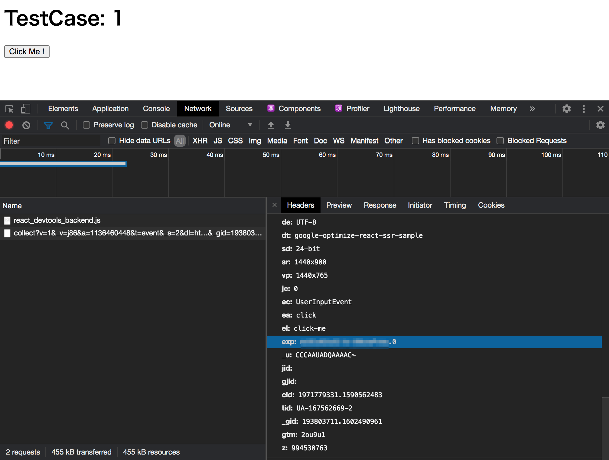

ここで紹介するのは[サーバーサイド テスト](https://developers.google.com/optimize/devguides/experiments?hl=ja)としてドキュメント化されている内容を React で書き起こしたものである。

## 事前準備

- Google Optimize のコンテナ ID
- Google Analytics のテスト ID

## 実装

以下の技術スタックで再現する

- express
- React

### 実装すべき項目

**サーバーサイド**

1. AB テストのターゲット初めて流入したとき、A/B/n のテストケースのいずれかに割り当てる
1. ターゲットの AB テストを 2 回目以降流入したときに前回のテストケース  に割り当てられるように状態を復元する
1. 復元したテストケースの情報が正しい情報か確認し、正しくない場合は破棄し、再度割り当てる
1. AB テスト期間外にターゲットが流入してきたとき、どのテストケースにも割り当てられないようにする。もしくはデフォルト値にする。
1. クライアントサイドに割り当てられたテストケースの情報を伝える



**クライアントサイド**

- `analytics.js`もしくは`gtag.js`で割り当てられたテストケースの情報をセットする
- Google Optimize の Container ID をセットする

### `gtag.js`で Google Optimize のテストケースを設定する

```html
<script>
  window.dataLayer = window.dataLayer || [];
  function gtag() {
    dataLayer.push(arguments);
  }
  gtag("js", new Date());
  gtag("config", "UA-...", {
    optimize_id: "OPT-...", // https://support.google.com/optimize/answer/7513085?hl=ja
    send_page_view: true, // https://support.google.com/optimize/answer/7513085?hl=ja
    /**
     * @see https://support.google.com/optimize/thread/36142685?hl=en&msgid=36785067
     * @see https://stackoverflow.com/questions/50686295/gtag-js-optmize-server-side-implementation-not-working
     */
    experiments: [
      {
        id: "TEST_ID",
        variant: 1,
      },
    ],
  });
</script>
```

gtag.js で Google Optimize のエクスペリエンスの情報をセットする方法は、公式のリファレンスでなかなか見当たらないが、気合で探すと StackOverflow と Support に存在した。

- https://support.google.com/optimize/thread/36142685?hl=en&msgid=36785067
- https://stackoverflow.com/questions/50686295/gtag-js-optmize-server-side-implementation-not-working

`@types/gtag.js`の型情報に明確に存在しないが、`gtag("config", "UA-", [CONFIG])`の第三引数は次のような型で拡張可能である。

```ts
interface Config {
  optimize_id?: string;
  send_page_view?: boolean; // default: true
  experiments?: {
    id: string;
    variant: number;
  }[];
}
```

### `analytics.js`でテストパターンを報告するのはドキュメントにある

- https://developers.google.com/optimize/devguides/experiments?hl=ja

### 動作確認する

#### サーバーの準備

Google Optimize は Cookie を利用して機能を提供するため、ローカルホストで行う動作確認を行う場合は、
`/etc/hosts`を書き換えて、適当なドメインで Optimize を調整すると良い。判定できるように指定してくと良い。

また、簡易に他のユーザーなどに動作確認してもらいたい場合は、`ngrok`や[`inlets`](../infrastructure/how-to-use-inlets)を利用するとよい。

#### テストケースが`GA`に送信されていることを確認する

計測する`onClick`などを適当に用意し、GA 上に送信すると、以下のように`exp`が QueryString Params として送信されていれば成功だ。



## 参考

- [参考実装 - Himenon/google-optimize-react-ssr-sample](https://github.com/Himenon/google-optimize-react-ssr-sample)
