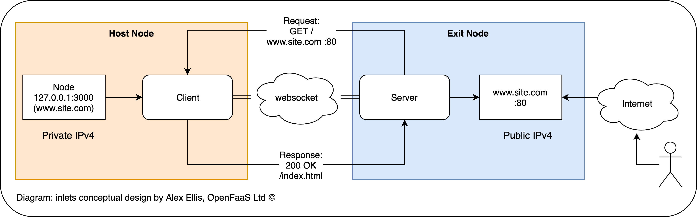

# inletsの紹介

## 忙しい人のための短い紹介

* [inlets](https://github.com/inlets/inlets)はMITライセンスのOSSなので自社サーバー上に構築することができる
* websocketも対応
* [Video DEMO](https://www.youtube.com/watch?v=jrAqqe8N3q4&feature=youtu.be)もあるよ
* 3分くらいで導入できる
* ローカルがインターネットに公開されるので気をつけて。

## 詳しく見たい人のための紹介

GitHub: https://github.com/inlets/inlets

[ngrok](https://ngrok.com/)をご存じの方は、ngrokのOSS版いえば理解できるでしょう。
MOONGIFTさんの記事（2019/05/04）[inlets - ローカルのサービスをインターネット上に公開する](https://www.moongift.jp/2019/05/inlets-%E3%83%AD%E3%83%BC%E3%82%AB%E3%83%AB%E3%81%AE%E3%82%B5%E3%83%BC%E3%83%93%E3%82%B9%E3%82%92%E3%82%A4%E3%83%B3%E3%82%BF%E3%83%BC%E3%83%8D%E3%83%83%E3%83%88%E4%B8%8A%E3%81%AB%E5%85%AC%E9%96%8B/)で紹介されています。

簡単に言えばローカルのサーバーをインターネットに公開するProxyのようなものです。

[](https://github.com/inlets/inlets/blob/master/docs/inlets.png)

利用する場面としては、ローカル開発環境を外部共有したような場面でしょう。
たとえば、

* SlackのRequest URLを指定するサーバーを構築するとき（いちいちデプロイするのが面倒な場合）
* 知見共有のためにローカルの環境を他者に共有する場合
* WEBをスマートフォンで動作確認するするため

など、開発時のユースケースが想像されます。

## 使い方

[Quick Tutorial](https://github.com/inlets/inlets#quickstart-tutorial)通りにやってみます。
どちらがサーバーでクライアントかわからなくなるで気をつけましょう。

### サーバー・クライアント両方のセットアップ

CLIをインストールしておきます。

* https://github.com/inlets/inlets#install-the-cli

### サーバー側

このサーバーのローカルホストから見たホスト名を仮に`inlets.himenon.github.io`としておきます。

`shasum`コマンドが入っていない可能性があるので、インストールしておきます。

```bash
# installerがyumの場合
yum -y install perl-Digest-SHA
```

inletsサーバーをport 8090で起動します。

```bash
export token=$(head -c 16 /dev/urandom | shasum | cut -d" " -f1)
inlets server --port=8090 --token="$token"
```

ログに以下のようなログが出力されます。

```bash
2019/12/26 14:06:20 Welcome to inlets.dev! Find out more at https://github.com/inlets/inlets
2019/12/26 14:06:20 Starting server - version 2.6.3
2019/12/26 14:06:20 Server token: "123456a78b9bcd012e3fg4h456i7890j123kl456"  <----- ここをクライアント側で利用する
2019/12/26 14:06:20 Control Plane Listening on :8090
2019/12/26 14:06:20 Data Plane Listening on :8090
```

### クライアント側

適当な場所でHTTP Serverを起動します。何を使っても良いですが、手軽にPythonでHTTPサーバーをport 8000で起動します。

```bash
# python 2系
python2 -m SimpleHTTPServer 8000
# python 3系
python3 -m http.server 8000
```

次に、inletsのサーバーと接続します。

```bash
export REMOTE="inlets.himenon.github.io:8090"            # Host名はIPアドレスでも良い
export TOKEN="123456a78b9bcd012e3fg4h456i7890j123kl456"  # サーバー側のToken
       inlets client \
       --remote=$REMOTE \
       --upstream=http://127.0.0.1:8000 \                # ローカルのHTTPサーバーのport番号
       --token $TOKEN
```

起動すると以下のようなログが出力されます。

```
2019/12/26 14:14:07 Welcome to inlets.dev! Find out more at https://github.com/inlets/inlets
2019/12/26 14:14:07 Starting client - version 2.6.3
2019/12/26 14:14:07 Upstream:  => http://127.0.0.1:8000
2019/12/26 14:14:07 Token: "123456a78b9bcd012e3fg4h456i7890j123kl456"
INFO[0000] Connecting to proxy                           url="ws://inlets.himenon.github.io:8090/tunnel"
```

### アクセスする

サーバー側にアクセス（`inlets.himenon.github.io:8090`）してみると、ローカルのサーバー（今回はPythonのサーバー）に接続されることが確認できます。

## おわりに

[inlets](https://github.com/inlets/inlets)の簡単な紹介をしました。
他にもいろいろとオプションがあったり、[Dockerイメージ](https://hub.docker.com/r/alexellis2/inlets)があったりするようです。
開発環境の共有を楽にするツールとしていかがでしょうか。
