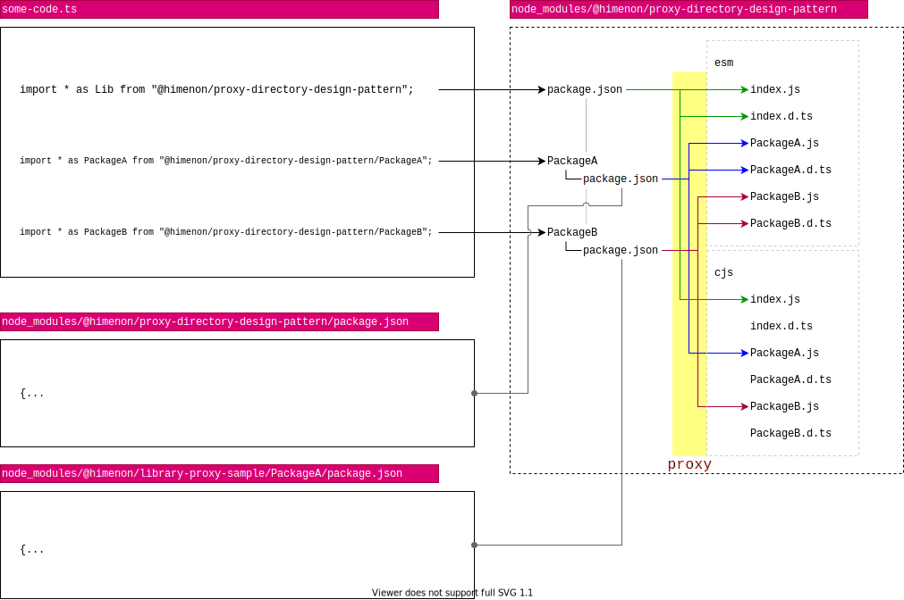

## 概要

ここではJavaScriptをパッケージ内の参照構造の整理方法の1つ、Proxy Directoryパターンを紹介する。
また、その準備として、ライブラリ内のファイルを直接参照するときの名前空間に余計なディレクトリを切らない方法をはじめに示する。

## ライブラリ内のファイル直接参照時の名前空間を整理する

### 整理されていな例

たとえば[csv-stringify@5.5.1](https://www.npmjs.com/package/csv-stringify/v/5.5.1)というライブラリで、
同期的にcsv形式のデータを生成する際の関数はは次のようにインポートする。

```ts
import stringify from "csv-stringify/lib/sync";

const stringify = require("csv-stringify/lib/sync");
```

ルートからexportされてないだけではなく、`lib`という本来ライブラリを利用するコンテキストでは不必要なパスが入っている。

### 整理されている例

たとえば[react-dom@16.14.0](https://www.npmjs.com/package/react-dom/v/16.14.0)はブラウザ用に利用するコードと、サーバーサイドで利用するコードの2種類がある。
ブラウザ側で利用する実装は次のように書ける。

```ts
import * as ReactDOM from "react-dom";

const ReactDOM = require("react-dom");
```

サーバー側で利用する実装は

```ts
import * as ReactDOM from "react-dom/server";

const ReactDOM = require("react-dom/server");
```

と書くことができ、不要なパスが存在せず、ライブラリ利用者は混乱する可能性がない。

### 実装方法

`react-dom`のような構造をどうやって実現しているのか、実際にパッケージをダウンロードして中身を確認したらわかる。

- [csv-stringify-5.5.1.tgz](https://registry.npmjs.org/csv-stringify/-/csv-stringify-5.5.1.tgz)
- [react-dom-16.14.0.tgz](https://registry.npmjs.org/react-dom/-/react-dom-16.14.0.tgz)

細かい部分は割愛するが、以下のようなディレクトリツリーをそれぞれ持つ。

```
csv-stringify-5.5.1
├── lib
│   ├── es5
│   ├── index.d.ts
│   ├── index.js
│   ├── sync.d.ts
│   └── sync.js
└── package.json
```

```
react-dom-16.14.0
├── LICENSE
├── README.md
├── index.js
├── package.json
└── server.js
```

ライブラリ名で直接インポートされるのは、`package.json`の[`main`フィールド](https://docs.npmjs.com/files/package.json#main)に記述されたもので、
`csv-stringify`の場合は`lib/index.js`、`react-dom`の場合は`index.js`が読み込まれる。

ここまでくるとおわかりだろうが、package.jsonの`main`フィールドに記述されていないライブラリ内のファイルを直接参照する場合、
ファイルのパスの起点は`node_modules/[library name]`となる。

したがって、不要なパスを直接参照時に含めたくない場合はライブラリのルートディレクトリにjsファイルもしくはディレクトリを直接配置し、名前空間を区切れば良い。

簡単にまとめると以下のようになる。

```
[library-root]
├── index.js
├── hoge.js       // require("[library-root]/hoge") で参照可能
├── foo
│   └── index.js  // require("[library-root]/foo")　で参照可能
└── package.json
```

## Proxy Directory

### `package.json`を`alias`として使う

先に示したように、`package.json`のフィールドに置いて、`main`フィールドはライブラリ内でaliasとして機能する。
また、TypeScriptにおいて、`types`フィールドが型定義のaliasとして機能する([参照](https://www.typescriptlang.org/docs/handbook/declaration-files/publishing.html))。

これらはよく知られたことだが、`package.json`にはあまり知られていないもう一つの特性がある。
ライブラリ内で`package.json`を複数持ち、alias用のファイルとして機能させることができることだ。
yarn/npm(v7以降) の`workspaces`でMonorepoを利用しているときとユースケースは近い。

具体的には次のようなことが可能となる。

```
[library-root]
├── index.js
├── foo
│   └── package.json // main/typesフィールドに記載されたディレクトリにリダイレクトする
└── package.json
```

```js
const foo = require("[library-root]/foo"); // 参照先はfoo/package.jsonの設定次第
```

参照解決のアルゴリズムはNode.jsの[Module API](https://nodejs.org/api/modules.html#modules_all_together)に記述がある。

### Tree Shakingに対応した実装コードの参照解決をする

現代のJavaScriptはwebpackやrollup、ParcelなどのバンドラーによるTree Shakingへの対応が求められる。
この対応をしなければファイルサイズの肥大化の原因となり[パフォーマンスの問題](https://dwango-js.github.io/performance-handbook/startup/module-field/)を引き起こす。解決にはesmodule形式のコード生成し、`package.json`の`module`フィールドに明示する必要がある。

- [Flagging modules are ESM - webpack](https://webpack.js.org/guides/ecma-script-modules/#flagging-modules-are-esm)

### 影響範囲と個別インポートと問題

`commonjs`用と`esmodule`用の両方を用意した場合、`package.json`の`main`と`module`にそれぞれ登録できるのは1ファイルだけである。
この場合、ライブラリ側を信用してパッケージのルートから必要なモジュールを読み込み、コードをTree Shakingにかける。
読み込んだモジュールの下位に属するモジュールが副作用([side effects](https://webpack.js.org/guides/tree-shaking/#mark-the-file-as-side-effect-free))を持たなければ問題ないものの、
万が一、副作用のあるコードが紛れ込んだときに、芋づる式にバンドルされてしまう可能性があり、影響範囲が大きい。

**問題点**

そのため、esmoduleの実装を個別にインポートすることができると望ましい。
ライブラリ利用者側が対応する必要が出てくるが、ライブラリの内部実装を利用者が知る必要が出てくる。
これではライブラリとして提供している意味がなくなってきてしまうので、なるべく利用者フレンドリーな提供方法が求められる。

**解決方法**

したがって、

- ライブラリ利用者側：[整理されている例](#整理されている例)で紹介したような形式で提供
- ライブラリ実装者側：[package.jsonをaliasとして扱えば](#packagejsonをaliasとして使う)

が達成されれば、両者が恩恵を受ける。

## [cherry-pick](https://www.npmjs.com/package/cherry-pick)ライブラリを利用してProxy Directoryを作成する

Proxy Directoryの作成にあたっては[cherry-pick](https://www.npmjs.com/package/cherry-pick)という先駆者がいる。
これを利用することで簡単にproxy directoryが生成できる。

インストールはいつもどおり次のようにする。

```bash
yarn add -D cherry-pick
```

CLIとして利用する場合は次の通り。

```bash
cherry-pick \
  --cwd       ./lib    # 出力先のルートパス
  --input-dir ../src \ # 対象ディレクトの直下にあるファイル名のProxy Directoryを作成する (cwdからの相対パス)
  --types-dir ./types  # .d.tsの出力ディレクトリ
  --cjs-dir   ./cjs \  # CommonJSの出力ディレクトリ
  --esm-dir   ./esm \  # esmoduleの出力ディレクトリ
```

これを実行すると、出力先にProxy Directoryが生成される。
実際にこれを利用しているライブラリとしては[react-bootstrap](https://github.com/react-bootstrap/react-bootstrap)が挙げられる。

また、筆者が用意した簡易なサンプルコードとDEMOは以下の通り。手にとって動かしてみてほしい。

### サンプルコード

* <https://github.com/Himenon/proxy-directory-design-pattern>

### DEMO

サンプルコードはパッケージを配布しているので、codesandboxで実際に手を動かして触ることが可能だ。

<iframe
  src="https://codesandbox.io/embed/proxy-directory-pattern-demo-4r7pu?fontsize=14&hidenavigation=1&theme=dark&view=editor"
  style={{
    width: "100%",
    height: "500px",
    border: 0,
    borderRadius: "4px",
    overflow: "hidden",
  }}
  title="proxy-directory-pattern-demo"
  allow="accelerometer; ambient-light-sensor; camera; encrypted-media; geolocation; gyroscope; hid; microphone; midi; payment; usb; vr; xr-spatial-tracking"
  sandbox="allow-forms allow-modals allow-popups allow-presentation allow-same-origin allow-scripts"
/>

### アーキテクチャ

Proxy Directoryのアーキテクチャを俯瞰した図で表すと次のようになる。



### ビルド周り

**工事中**: 全部書くと長く本筋とずれる可能性がるので別の記事に書くかもしれません。

## まとめ

Proxy Directoryパターンの恩恵は以下。

* 小さな範囲でコードを利用することが可能になる。
* 副作用の有無の把握が容易になる。
* cjsとesmoduleの両方に対応したコードを同時に公開できる。
* ライブラリの利用者にcommonjsとesmoduleの明示的な選択を強制する必要がなくなる。

## Reference

- ライブラリ
  - https://www.npmjs.com/package/cherry-pick
- 実装例
  - <https://github.com/react-bootstrap/react-bootstrap>
- 記事
  - [How to Create JavaScript Libraries in 2018 (Part 2)](https://developers.livechat.com/updates/how-to-create-javascript-libraries-in-2018-part-2/#proxy-directories)
  - [package.jsonのmainとmodule - Mission-Street.](https://hakozaru.com/posts/package-json-main-module-field)
  - [複数のモジュール形式(CommonJS, ES Modules, UMD)をサポートしたnpmパッケージの作り方 in TypeScript - dackdive's blog](https://dackdive.hateblo.jp/entry/2019/09/23/100000)
  - ["module"フィールド対応 - Webフロントエンド パフォーマンス改善ハンドブック](https://dwango-js.github.io/performance-handbook/startup/module-field/)
- API
  - [Module API](https://nodejs.org/api/modules.html#modules_all_together)
