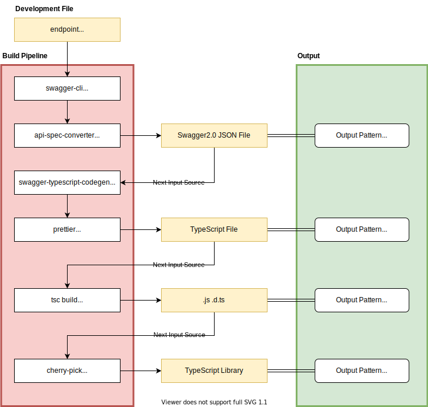

## OpenAPI Specification(OAS)とはなにか

[OpenAPI Specification](https://github.com/OAI/OpenAPI-Specification)はAPIを記述するため規格で、旧名がSwaggerとなっている。

### 百聞一見に如かず

簡単な例として、`/api/article`という記事を作成するAPIに対して、POST Methodで通信するとき、Request/ResponseのInterfaceを次のように定義する。

```ts
interface RequestBody {
  title: string
  body: string
}

interface ResponseBody {
  id: string;
}
```

これをOASで書き起こすと次のようになる。

```yml
paths:
  /api/article:
    post:
      operationId: createArticle          # コード自動生成時の関数名となる
      summary: 記事を作成するAPI
      requestBody:
        content:
          application/json:
            schema:
              type: object
              additionalProperties: false # Objectの拡張を許さない
              required:                   # requiredがないObjectのValueはOptional[?]扱いになる
                - title
                - body
              properties:
                title:
                  type: string
                body:
                  type: string
      responses:
        200: # HTTP Status Code
          description: 記事が正常に作成された
          content:
            application/json:
              schema:
                type: object
                additionalProperties: false
                required:
                  - id
                properties:
                  id:
                    type: number
                    description: 記事のID
```

`schema`の部分がデータの定義で、それ以外はHTTP通信や説明などに関する情報を記述する。
何度も書くとドキュメントを見なくても勝手にかけてしまうので恐れることはない。

### なぜOpenAPI Specificationで書くか

- OAS3.0で記述すことにより、API仕様書はどの言語にも依存していない
- API仕様書からさまざまな言語に出力するライブラリが存在する
- REST APIは仕様書があれば実装を生成できる世界なので人間が介在する必要のない分野である
- 品質を担保できる
- 実装速度を高めることができる（工数削減）
- APIの利用者ではなくAPIの実装者がSpecificationを書くだけで良い

## TypeScript向けのビルドパイプラインの設計

OASから実装に変換するフロートで、もっともシンプルなのは単純に変換することである。

```
OAS(yaml/json) --> TypeScript/JavaScript...etc
```

しかしながら、これだけでは実用に耐えられない。
APIのエンドポイントは複数合ったり、JavaScriptのライブラリとして提供するための体裁を整えたり、ドキュメントを出力するなど必要とされる状況やモノが多くある。

整理すると次のとおりだ。

### 複数のエンドポイントを要求

昨今はクライアントに対して1つのAPIエンドポイントになることはほとんどない。
`api1.example.com, api2.example.com, ...etc`といった具合に使う場面はスケールしていくことを考慮する必要がある。
呼応して、APIのMock Serverもドメイン単位で構築されたほうが良いだろう。

### JavaScriptライブラリとしての要求

1. OAS(yaml)からTypeScriptの実装コードが吐き出せること
2. 実装コードを出力するためのテンプレートが利用者によって変更が可能であること
3. TypeScriptをビルドして、型定義ファイル（`.d.ts`）とJavaScriptのコードが吐き出されること
4. TypeScriptはesmoduleとcommonjs形式の両方でビルドされること

これらを整理して考案したビルドパイプラインを次に示す。詳細は後に説明する。

### OASからTypeScriptを生成するための設計

#### ディレクトリ構成

ドメインがスケールできるように対応するために次のような構造をとった。

```
openapi-specification
├── CHANGELOG.md
├── LICENSE
├── README.md
├── docs                          # ドキュメントを生成場所
│   └── endpoints
│       └── api.example.com.json  # OASのYAMLを1つのJSONにまとめたもの
├── endpoints                     # OASを記述する場所
│   ├── api.example.com           # ドメイン単位でディレクトリを分ける
│   │   └── index.yml
│   └── api2.example.com          # ドメイン単位でディレクトリを分ける
│       └── index.yml
├── lerna.json
├── lib                           # JavaScriptライブラリの生成場所
├── package.json
├── scripts                       # ビルド関連のスクリプトを配置
├── source                        # TypeScriptの生成場所
├── tsconfig.build.json
├── tsconfig.cjs.json
├── tsconfig.esm.json
├── tsconfig.json
└── yarn.lock
```

#### ビルドパイプライン

概略的な図を示すと次のようになる。



詳細を書く前にまずは技術選定から説明する必要がある。

**技術選定**

OpenAPI SpecificationからTypeScriptのコードと、ドキュメントを生成するためのツールとして利用したものは次の4つ。

* @apidevtools/swagger-cli
  - **用途**：YAMLの`$ref`などを解決して単一のJSONファイルに結合する
  - **採用理由**
    - 単一ファイルにすることにより成果物にブレがなくなる
  - [npm](https://www.npmjs.com/package/@apidevtools/swagger-cli)
  - [GitHub](https://github.com/APIDevTools/swagger-cli)
* api-spec-converter
  - **用途**：OAS3.0のJSON(or YAML)をSwaggerの2系のjson変換する
  - **採用理由**
    - Specificationの仕様が変更されてもコンバートできる
  - [npm](https://www.npmjs.com/package/api-spec-converter)
  - [GitHub](https://github.com/LucyBot-Inc/api-spec-converter)
* swagger-typescript-codegen
  - **用途**：Swagger 2系のjsonからTypeScriptのコードを生成する
  - **採用理由**
    - コードジェネレーターが出力言語と同じなので不具合ができても対応できる
    - ジェネレートされる実装を調整しやすい
  - [npm](https://www.google.com/search?q=swagger-typescript-codegen)
  - [GitHub](https://github.com/mtennoe/swagger-typescript-codegen)
* @stoplight/prism-cli
  - **用途**：OAS3.0の単一のJSONを読み取りAPI MockServerを生成する
  - **採用理由**
    - 実装がJavaScriptなのでメンテナンスできる
  - [npm](https://www.npmjs.com/package/@stoplight/prism-cli)
  - [GitHub](https://github.com/stoplightio/prism)
* swagger-ui
  - **用途**：OAS3.0の単一のJSONを読み取りドキュメントを生成する
  - **採用理由**
    - 都度HTMLが生成されないのでHTML自体のビルド時間がゼロ
    - OAS3.0のJSONのパスを指定するだけで良い
  - [GitHub](https://github.com/swagger-api/swagger-ui)

今回選ばなかったもの

* @openapitools/openapi-generator-cli
  - **不採用の理由**
    - 実装がJavaなのでTypeScript/JavaScriptを扱っているチームではログを読むことが難しく、保守できない
    - インストールが重い
  - [npm](http://npmjs.com/@openapitools/openapi-generator-cli)
  - [GitHub](https://github.com/OpenAPITools/openapi-generator)
* typescript-fetch
  - **不採用の理由**
    - deepObjectが壊れている[#6706](https://github.com/OpenAPITools/openapi-generator/pull/6706)
    - 実装がJava
  - [GitHub](https://github.com/OpenAPITools/openapi-generator/blob/master/docs/generators/typescript-fetch.md)
* typescript-axios
  - **不採用の理由**
    - 生成された実装のリクエストパラメーターの入力形式が関数の引数を増やす形式で使いづらい
    - 実装がJava
  - [GitHub](https://github.com/OpenAPITools/openapi-generator/blob/master/docs/generators/typescript-axios.md)
* redoc
  - **不採用の理由**
    - curlコマンドが生成されない
    - HTMLをエンドポイント単位で生成する必要があるのでビルドに時間を要する
  - [npm](https://www.npmjs.com/package/redoc)
  - [GitHub](https://github.com/Redocly/redoc)

**パイプラインの説明**

技術選定の内容を再度書き下す形式になってしまうが、次のように構成されている。

TypeScriptとドキュメントの生成

1. `endpoints/{domain}/index.yml`をビルドのエントリーファイルとする
2. `@apidevtools/swagger-cli`を用いて、エントリーファイルを`docs/endpoints/{domain}.json`にOAS 3.0のJSONに変換する
3. `api-spec-converter`を用いてOAS3.0をSwagger 2系に変換する
4. Swagger 2系に変換されたデータを`swagger-typescript-codegen`に与えることでTypeScriptの実装を`source/{domain}.ts`として出力する
5. [Proxy Directory Pattern](../javascript/proxy-directory-design-pattern)(※別記事参照)を用いてライブラリの体裁を整える

Mock Serverの起動

```bash
yarn run mock:server {domain}
```

## 実装サンプル

これらの設計を実装に落としたサンプルは以下のリポジトリにあります。

* [Himenon/openapi-typescript-practice](https://github.com/Himenon/openapi-typescript-practice)

## 最後に

今回利用した`swagger-typescript-codegen`は万能ではありません。
OASの`oneOf`などのTypeScriptのUnion型で表現することが難しい場面もあります。
そのため、API Clientを自前で書く必要はなくなったが、コードジェネレーターをメンテナンスする必要は出てきます。
