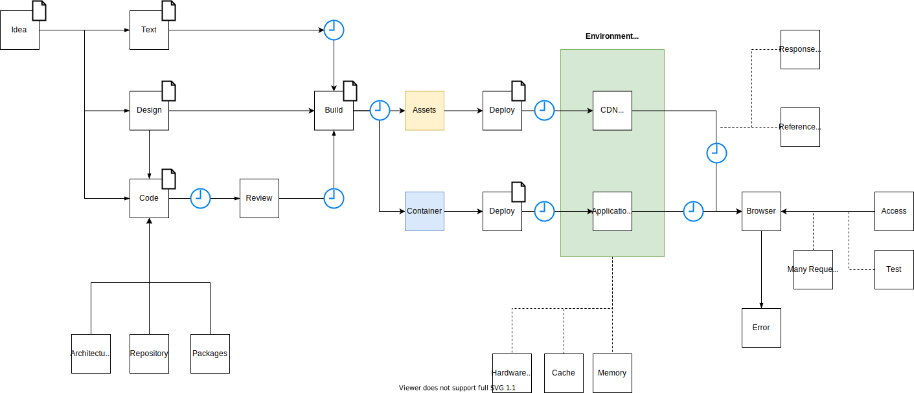

## 問題点洗い出し

### 対策記事のある問題

| 問題点                                                                                                   | 内容                                                                                                   |
| :------------------------------------------------------------------------------------------------------- | :----------------------------------------------------------------------------------------------------- |
| [成果物のサイズが大きくなる問題](increased-size-of-artifacts-with-svg-file-bundles.md)                   | サイズが大きくなっていることに気が付かない問題。                                                       |
| [(Docker)コンテナのサイズが大きい問題](minify-node-modules-into-a-container.md)                          | コンテナのサイズが大きい問題。主に`node_modules`を含むと 500MB 以上になりうる。                        |
| [初期化問題](initialize-problem)                                                                         | Time to Interactive の時間を決定する問題。同期的初期化と非同期初期化（遅延初期化）の取り扱いの問題     |
| [環境ごとの基底 URL 定義変更問題](base-url-definition-change-problem-for-each-environment.md)            | 環境ごとに基底 URL を切り替える必要がある問題。環境ごとの値の変更                                      |
| [minify や難読化されたコードのデバッグ](debugging-minified-code.md)                                      | 本番環境で不具合が発生した時に成果物に minify されたコードしかない場合、再ビルドする必要が出てくる問題 |
| [DEMO の共有](demo-sharing.md)                                                                           | 容易にホスティングできない DEMO を開発者らに共有するときに、わざわざクローンさせる手間の問題           |
| [API Client 増加問題](api-client-increase-problem.md)                                                    | HTTP/websocket/RPC などの各種クライアントがエンドポイント単位で作成されメンテナンスコストが増える問題  |
| [SVG ファイルバンドルによる成果物のサイズ増加問題](increased-size-of-artifacts-with-svg-file-bundles.md) | SVG ファイルをバンドルすることによりサイズが肥大化する問題                                             |
| [UI の一時的な状態の保持](temporary-ui-state-preservation.md)                                            | 機能の一時的な状態保持の問題。URL 変更時のローカルストレージ移行など。                                 |
| [UI の表示の組み合わせの網羅性](comprehensive-ui-display-combinations.md)                                | 動作確認における UI の表示の組み合わせが多くの再現が困難ケースがある問題                               |

### 対策記事執筆予定 / 整理中

| 問題点                                    | 内容                                                                                                                                                                |
| :---------------------------------------- | :------------------------------------------------------------------------------------------------------------------------------------------------------------------ |
| Static ページのデプロイとキャッシュの揮発 | Static Site のキャッシュがデプロイ時に揮発しなければキャッシュにアクセスしてしまう問題                                                                              |
| Server Side Rendering のキャッシュ        | アプリケーションが肥大化すると Server Side Rendering にかかる時間とメモリーなどのリソースが消費される問題                                                           |
| `devDependencies`の`dependencies`依存     | `devDependencies` のライブラリが `dependencies` で利用しているライブラリに依存しているため、双方に依存するライブラリの更新が`devDependencies`によって妨げられる問題 |
| 画像の差分テストの実施                    | 差分画像のホスティング先の問題                                                                                                                                      |
| Pull Request ごとの UI のプレビュー       | Pull Request 時に Build 後の成果物のプレビューをどうやるかという問題                                                                                                |
| Client Side Performance                   | 複雑な処理フローによるパフォーマンス悪い箇所の特定が難しい。また、効果が期待できるか簡単に分からなくなる問題                                                        |
| Server Side Performance                   | First Content Paint(FCP)までの処理内容の肥大化。BFF などの各種 API を叩くことによる FCP の遅延とリソース消費の問題                                                  |
| Build 設定の難化                          | アプリケーション単位で用意されたビルド設定の非対称さと保守コストの増大                                                                                              |
| ビルド単位が大きく再ビルドに時間がかかる  | 巨大なアプリケーションを 1 回のフローでビルドする時に発生する問題。長時間のビルド。                                                                                 |
| Package バージョン管理問題                | 依存ライブラリが多いためにバージョン上げのコストが高い問題                                                                                                          |
| 文言データの管理                          | 非エンジニアとの共有のための一元管理をどう実現するかという問題                                                                                                      |
| 計測処理                                  | 何をどこでどの期間計測するかという問題。継続性。                                                                                                                    |
| Error Handling の場所と内容               | エラーの内容が原因を突き止めるのに不足している。どこをハンドリングするかという問題。                                                                                |
| 静的リソースの管理問題                    | 参照が切れる問題。非エンジニアによる管理問題                                                                                                                        |
| メンテナンスモード                        | 静的サイトのメンテナンスモードをどのように実現するかという問題                                                                                                      |
| npm-scripts の肥大化                      | 利用されていないコマンドや、用途不明のコマンドの保守の問題                                                                                                          |
| npm install / yarn install が遅い         | 通信環境や帯域削減などによってインストールが遅くなる問題                                                                                                            |
| 非エンジニアのためのリリースノート        | サービスリリースの場合、非開発者向けに対してもわかるリリースノートを書く必要がある問題                                                                              |
| リアルタイム通信におけるリクエスト処理    | サーバーサイドによる Validation 処理の問題                                                                                                                          |
| 機能のポータビリティ                      | 開発時に機能が独立してかどうするかどうかという問題。                                                                                                                |
| クライアントのロギング                    | クライアントサイドのログをどうやって補足するかという問題                                                                                                            |
| リンクによる遷移先の管理                  | 導線の管理問題                                                                                                                                                      |
| 設計の可視化                              | 依存関係や処理の流れを可視化して知識を共有する問題                                                                                                                  |
| コードの循環参照問題                      | コードのいびつ性の問題                                                                                                                                              |
| ライブラリの順序の確認問題                | ライブラリの依存関係とその更新順序を導き出す問題                                                                                                                    |
| 開発支援ツールのサーバー                  | Bot や Cron 系のジョブをホスティングするサーバーを必要とする問題。簡易 SaaS                                                                                         |
| クライアントの小さな挙動対応              | 要求定義/要件定義に記述されていないクライアントごとの細かな挙動調整とその挙動をドキュメントに起こすことが細かい手間である問題。詳細度の問題                         |
| シークレット情報を含む開発環境の問題      | 疎通に必要なシークレット情報が個々人で管理できない場合の開発方法                                                                                                    |

### 対策検討中

| 問題点                        | 内容                                                                                     |
| :---------------------------- | :--------------------------------------------------------------------------------------- |
| Git Repository 増加問題       | リポジトリが増えるとメンテナンスされなくなるリポジトリが発生する問題                     |
| Monorepo によるビルド時間増加 | トポロジカルソートの順序でビルドされるため、下層のライブラリのビルド時間が加算される問題 |
| テスト時間の長期化            | テスト項目の増加による時間の増加                                                         |
| `deprecated`の扱い            | API 廃止時のマイグレーション計画や影響範囲の調査が必要になる問題                         |
| ドキュメントの老朽化          | ドキュメントを見た時に初めて追従してないことに気がつく程度に古くなる問題                 |
| 対応ブラウザ                  | API が非対応のブラウザの問題                                                             |
| 大量の更新の処理              | リアルタイム通信などによる DOM の更新処理に関する問題。                                  |
| 大量のリクエスト処理          | 高 rps による DOM 再描画の負荷問題                                                       |
| React/Vue/Angular の代替問題  | 利用するフレームワークを変更する時に発生する移行の問題                                   |
| e2e テスト                    | テスト項目を追加削除する保守の問題                                                       |

<!-- ## 図で見る問題点 (工事中)

 -->

<!-- ### 参考文献

- https://panda-program.com/posts/bengo4com-library-frontend
- https://www.yuuniworks.com/blog/2018-05-18-presentational-component%E3%81%A8container-component/
- https://medium.com/@dan_abramov/smart-and-dumb-components-7ca2f9a7c7d0 -->
