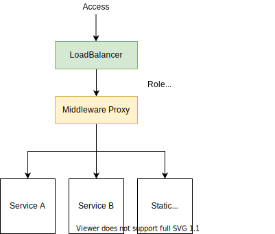

## まとめ

* Proxy Serverを挟み条件分岐を行う。

## 原因

* nginxやApacheなどにメンテナンス用のロジックを書いている
  * もしくは書けない

## 対策

* [node-http-proxy](https://github.com/http-party/node-http-proxy)を利用してProxy Serverを構築する

## 対策の動機

* 静的サイト内でfetchしてメンテナンスかどうかを判定するのは一手遅い。またAPIリクエストを問い合わせる先がメンテナンスの可能性もある。
* メンテナンス情報だけでなく、ログイン/非ログインの状態などのロジックもProxy Serverに配置することが可能となる

## 導入方法

* コンテナを利用している場合[サイドカーパターン](https://docs.microsoft.com/ja-jp/azure/architecture/patterns/sidecar)を利用する手段がある
* 静的サイトの前にProxy Serverをデプロイする

## 継続方法（運用）

* Proxy Serverがリクエストの負荷に耐えられるか検証する

## 対策の問題点

* ロードバランサーのプラグインなどで実現できる可能性がある。

## 展望

* envoyで実現できるか

## 参考資料

類似の技術としてログインを必要とする機構を設けるProxyがある。

* [oauth2-proxy](https://github.com/oauth2-proxy/oauth2-proxy)
