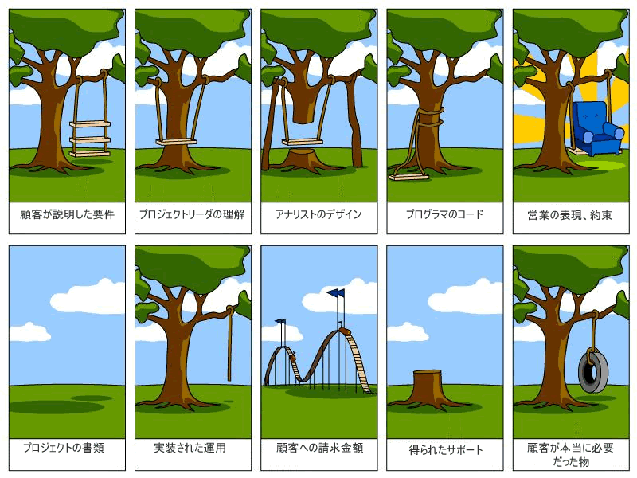

## はじめに

顧客の求めているものを実現させるために要望を的確に捉えることは難しい、よく言われる。
それを表現させた以下の図は有名だろう。

> 引用: <https://www.casleyconsulting.co.jp/blog/engineer/4334/>

また、ソフトウェア業界では「必要だったもの」を提供したとしても抱えているユーザー数が多いと「必要だったもの」が、人によって「不必要なもの」と捉えられたり、求めているものと違ったりユーザーの捉え方次第で複数の捉えられ方をする。

ここではサービスを提供する上で、取り巻く考えをまとめていきたい。

## ソフトウェア開発における「本当に必要だったもの」を実現するために考えること

ここでは表で一覧を表す。それぞれの詳細は別の記事にまとめている。

### 制約条件

| 制約条件   | 内容                                                                     |
| :--------- | :----------------------------------------------------------------------- |
| 時間       | 納期。実装期間。                                                         |
| 予算       | 制作にかかる予算はどれくらいか。人的リソース、物理的リソース。           |
| 実装難易度 | 実装難易度とそれに取り組む人間のスキルが足りているか。                   |
| 保守コスト | 保守し続けることが可能なものか。                                         |
| 運用コスト | 継続的に運用し、運用トラブルが発生した場合にリカバリー可能か。           |
| 心理負荷   | 成果物に対して実装者、運用者、顧客がフラストレーションを感じていないか。 |
| 物理負荷   | 成果物自身と成果物と結合したシステムがどれくらいの負荷に耐えられるか。   |

[記事へ](./theory-of-constraints)

### 事前調査と設計

| 調査項目           | 内容                                                                           |
| :----------------- | :----------------------------------------------------------------------------- |
| 前例・類似物       | 類似のシステムやサービスが内外に存在しないか確認。前例踏襲しない場合はなぜか。 |
| ユーザーヒアリング | 顧客が求めているものを直接聞き出す。アンケートや電話など。                     |
| 統計データ         | 顧客の求めている「もの」対して統計データから何らかのパターンを抽出できるか。   |
| ペルソナ           | 製作者側が認識しているユーザー像を構築する。                                   |

[記事へ](./preliminary-research-and-design.md)

### 成果物の期待値

| 期待値           | 内容                                                                               |
| :--------------- | :--------------------------------------------------------------------------------- |
| 抽象度           | 必要としているものが適切な抽象度か。「真に必要なもの」が見えにくくなっていないか。 |
| スケーラビリティ | 他に応用が効くものとして扱えるか。扱えない場合はなぜか。                           |
| UI/UX            | 「制約条件」と「調査」の結果を踏まえたものになっているか。                         |

[記事へ](./preliminary-research-and-design.md)

### フィードバック

| フィードバックの種類 | 内容                                                                         |
| :------------------- | :--------------------------------------------------------------------------- |
| レビュー             | 直接感想を送ってもらう。もしくは SNS などで収集すること。                    |
| 数値計測             | CVR や CTR、その他、定量的かつ継続的に計測できること。                       |
| KPT                  | リリースされるまでのフローや成果物に対して良い部分、改善したい部分を振り返る |

[記事へ](./feedback)

### 思想と五感

| 項目 | 内容                                                                                       |
| :--- | :----------------------------------------------------------------------------------------- |
| 直感 | 「制約条件」や「調査」を踏まえた上で顧客の想像を超える考えがあり、競合  と一線を画す考え。 |
| 思想 | 会社やサービスの方針に従い、「制約条件」「調査」を覆すもの。                               |
| 推論 | 「制約条件」と「調査」ができない、もしくは度外視したときに「〜だろう」と予想すること。     |

[記事へ](./thought-and-senses)

### 改善と撤退

| 項目     | 内容                                                                                                         |
| :------- | :----------------------------------------------------------------------------------------------------------- |
| 改善設計 | **顧客の求めているものと乖離が深い**場合にどのように改善するか。                                             |
| 撤退基準 | 「制約条件」を満たさない場合や、利益相反や、**顧客の求めているものと違った**場合など、どのレベルで撤退するか |

[記事へ](./improvement-and-withdrawal)

## 参考

- [制約条件の理論](https://ja.wikipedia.org/wiki/%E5%88%B6%E7%B4%84%E6%9D%A1%E4%BB%B6%E3%81%AE%E7%90%86%E8%AB%96)
