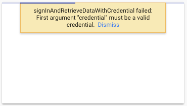

# FirebaseのAuthで躓いたこと

## signInAndRetrieveDataWithCredential failed: First argument "credential" must be a valid credential.  Dismiss



### 状況

FirebaseのサンプルコードにFirebase UIをツッコんで検証しようとした。
すると、画像のようなエラーがでた。

### 原因

これ、すごい単純で、firebaseのバージョンが古かったです。

**Before**

```
"firebase": "^4.5.0",
"firebaseui": "^2.7.0",
```

**After**

```
"firebase": "^4.12.1",
"firebaseui": "^2.7.0",
```

### 対策

他のpackageでも言えますが、

1. Release Noteを見る。
1. 上記がない場合、`package.json`から`firebase-ui`の`dependencies`で読み込まれている`firebase`のバージョンを確認する。

[package.json#54](https://github.com/firebase/firebaseui-web/blob/v2.7.0/package.json#L54)

2つ目が確実か。


## onAuthStateChangedで取得できるuserのパラメータが違う？

下記のコードを走らせる。

```js
auth.onAuthStateChanged(user => {
  console.log(user)
})
```

**firebase-uiでのログインをした時**

```js
Hk {D: Array(0), G: {} .....
```


## VuexのNamespaceを使ったときのエラー


```
RangeError: Maximum call stack size exceeded
Uncaught RangeError: Maximum call stack size exceeded
```
