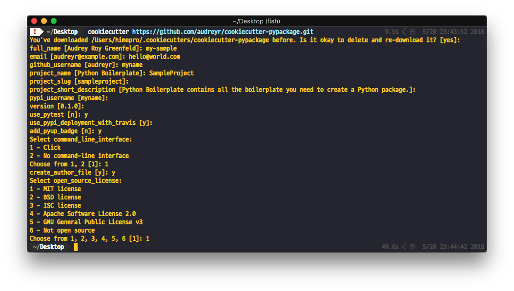

# 自作のファイルテンプレート(雛形)を生成するCookiecutterの使い方

<p id="created_at">作成日: <time dateTime="2018-05-20T22:00">2018/05/20 22:00</time></p>
<p id="updated_at">更新日: <time dateTime="2018-05-21T18:00">2018/05/21 18:00</time></p>

開発に限らず、PC作業をしているとさまざまな場面でファイルやディレクトリツリーを構築します。
ここでは、生成されるこれらのファイル、ディレクトリ群をまとめてプロジェクトレイアウトと呼称します。

プロジェクトレイアウトをコピペで作っていると、プロジェクト名が異なっていると、
影響するファイル名やClass名が多いでしょう。
そんなツールの1つにcookiecutterというオープンソースがあります。

* [audreyr/cookiecutter](https://github.com/audreyr/cookiecutter)

図で説明すると、次のようになります。



- プロジェクトの雛形: Githubリポジトリ or ローカル
- 雛形に挿入する値: cookiecutter利用者に委ねられる。デフォルトはインタラクティブに入力。
- Project Layout: 出力結果。

## 使い方

### インタラクティブに使う

もっともシンプルなコマンドは、引数にテンプレートのURLもしくは相対パスを指定することです。

Pythonのパッケージを作る際のボイラープレートで試してみます([audreyr/cookiecutter-pypackage](https://github.com/audreyr/cookiecutter-pypackage))。

```bash
$ cookiecutter https://github.com/audreyr/cookiecutter-pypackage.git
```



対話式に聞かれた後に、プロジェクトレイアウトが生成されます。

### Help

`cookiecutter -h` でヘルプを表示しておきます。

```
Usage: cookiecutter [OPTIONS] TEMPLATE [EXTRA_CONTEXT]...

  Create a project from a Cookiecutter project template (TEMPLATE).

  Cookiecutter is free and open source software, developed and managed by
  volunteers. If you would like to help out or fund the project, please get
  in touch at https://github.com/audreyr/cookiecutter.

Options:
  -V, --version              Show the version and exit.
  --no-input                 Do not prompt for parameters and only use
                             cookiecutter.json file content
  -c, --checkout TEXT        branch, tag or commit to checkout after git clone
  -v, --verbose              Print debug information
  --replay                   Do not prompt for parameters and only use
                             information entered previously
  -f, --overwrite-if-exists  Overwrite the contents of the output directory if
                             it already exists
  -o, --output-dir PATH      Where to output the generated project dir into
  --config-file PATH         User configuration file
  --default-config           Do not load a config file. Use the defaults
                             instead
  --debug-file PATH          File to be used as a stream for DEBUG logging
  -h, --help                 Show this message and exit.

```

## 自分のテンプレートを作る

とてもシンプルです。
CookieCutterは内部のテンプレートエンジンに[Jinja2](http://jinja.pocoo.org/docs/2.10/)を採用しており、
Jinja2の記法が利用できます。

### 速攻サンプル

最もシンプルなテンプレートを作成してみます。

```
simple-template/
├── cookiecutter.json
└── {{cookiecutter.project_name}}/
```

`cookiecutter.json`の中身は次のようにします。

```
{
	"project_name": "hello-world"
}
```

次に、`simple-template`をテンプレートとして利用してみます。

```bash
$ cookiecutter ./simple-template
```

これでテンプレートとして利用できます。

### カスタマイズ方法

cookiecutterで自作テンプレートを作るときは、次のルールを守っておけば良いでしょう。

1. 変数の定義は`cookiecutter.json`に書く。
    - 利用可能な型は、String, List, Dictionaryです。
2. 変数を展開する場所では`{{cookiecutter.xxx}}`のように、Jinja2のテンプレートが展開できる記法で記述し、`cookiecutter`のメンバ変数として展開できるようにしておく。
    - 展開時に、条件分岐を行ったり、for-loopを利用することも可能です。


詳しい説明は[Advanced Usage - cookiecutter](https://cookiecutter.readthedocs.io/en/latest/advanced/index.html)に載っています。

また、既に公開されているcookiecutter用のテンプレートを見てみることもお勧めします。

- [cookiecutter.json - audreyr/cookiecutter-pypackage](https://github.com/audreyr/cookiecutter-pypackage/blob/master/cookiecutter.json)

## 公開する

とてもシンプルな答えはGithubやBitbucketにホスティングすることです。

## 最後に

作っては捨て、という大量生産大量消費の時代にもってこいなパッケージとなっております。
cookiecutterはPythonで作成されていますが、テンプレートとするプロジェクトは言語を問いません。

DEMOでプレビューするときや、ちょっとした検証をしたい時用の雛形を予め作っておくと時間の節約になります。


