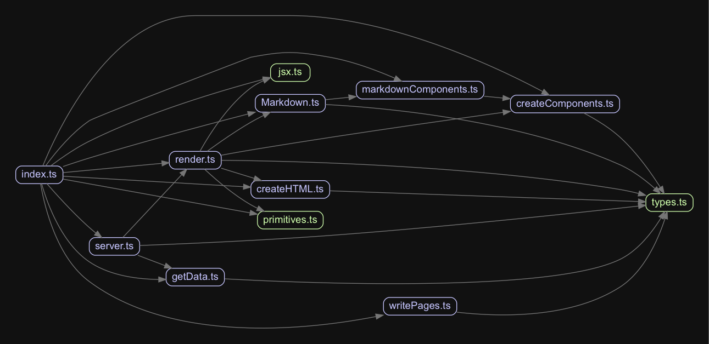

# genといライブラリの改修作業の進捗

* Created at 2018/09/22 00:05

[こいつ](https://github.com/Himenon/gen/pull/1)の進捗でも書きますか。


## ライブラリのバージョンを上げた

`yarn outdated`で確認

```sh
Package            Current  Wanted  Latest  Location
chokidar             2.0.4   1.7.0   2.0.4  @compositor/gen
gray-matter          4.0.1   3.1.1   4.0.1  @compositor/gen
load-json-file       5.1.0   4.0.0   5.1.0  @compositor/gen
meow                 5.0.0   4.0.1   5.0.0  @compositor/gen
read-pkg             4.0.1   3.0.0   4.0.1  @compositor/gen
read-pkg-up        MISSING   3.0.0   4.0.0  @compositor/gen
remark               9.0.0   8.0.0   9.0.0  @compositor/gen
remark-slug          5.1.0   4.2.3   5.1.0  @compositor/gen
styled-components    3.4.9   2.4.1   3.4.9  @compositor/gen
styled-system        3.1.4   1.1.7   3.1.4  @compositor/gen
ws                   6.0.0   3.3.3   6.0.0  @compositor/gen
```

次のアップグレードコマンドで何も考えずに最新バージョンまですべて上げた。

```sh
yarn upgrade-interactive
```

結果として、`ws`に至っては3.3.3はバグ(ページリロード時にプロセスが死ぬ)があったが、6.0.0にしたら自然と修正された。
`styled-system`は型があたり、むしろ保守性が向上した。

## 型があたっていないのを解消

次の2つのライブラリの型があたっていないライブラリがあったので、型定義ファイルを用意しました。

* [jonschlinkert/gray-matter](https://github.com/jonschlinkert/gray-matter)
* [threepointone/glamor](https://github.com/threepointone/glamor)

gray-matterは同種のPRが2つ投げらてているが、マージされていないので静観することにする。

* https://github.com/jonschlinkert/gray-matter/pull/77
* https://github.com/jonschlinkert/gray-matter/pull/74

glamorに至っては、型定義ファイルが用意されているにもかかわらず、最新版(v2.20.40)をnpmリポジトリインストールすると
`server.d.ts`が落ちてこない。ISSUEも上がっている。

* https://github.com/threepointone/glamor/issues/383

これも静観。

## とりあえず

`tsconfig.json`のルールを厳しくしていて、それに則って修正をしている。
今回の型定義ファイルを当てることで、

```json
"noImplicitAny": true
```

が`true`で維持された。

## どうやったか

tsconfigファイルにpathsを与えただけ。

```json
{
  "compilerOptions": {
    "paths": {
      "gray-matter": [
        "./typings/grapy-matter" 
      ],
      "glamor*": [
        "./typings/glamor*"
      ],
    }
  }
}
```

* [Module Resolution · TypeScript](http://www.typescriptlang.org/docs/handbook/module-resolution.html)


## 次

依存関係は次の画像のようになっていて、工事中、という感じ。
`types.ts`は[sverweij/dependency\-cruiser: Validate and visualize dependencies\. With your rules\. JavaScript, TypeScript, CoffeeScript\. ES6, CommonJS, AMD\.](https://github.com/sverweij/dependency-cruiser)に怒られないように、と逃げ道っぽくおいている。



型を当てただけで、どこが何をしているのかを完全に把握はしていない。
まずはそこからやっていく。パット見面白かったのがReactの[renderToStaticMarkup](https://reactjs.org/docs/react-dom-server.html#rendertostaticmarkup)というメソッド。
これを使うとreactから静的なHTMLファイルを出力することができる。こんなのがあったのかぁ。

### 脱線

画像は[pahen/madge: Create graphs from your CommonJS, AMD or ES6 module dependencies](https://github.com/pahen/madge)で出力した。
小規模ならこれで十分事足りている。

コマンドはこんな感じ。

```
madge src/index.ts --image output.png
```
