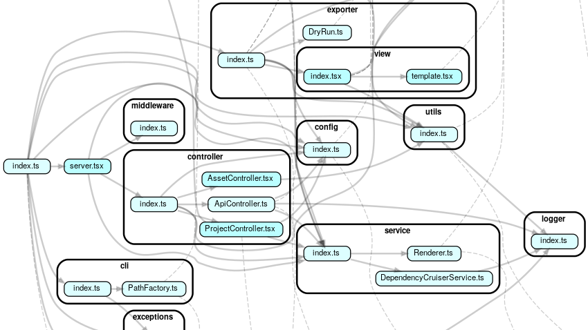

[](https://himenon.github.io/code-dependency/project/src/)

**追記情報**

* v0.5.0で`.vue`の拡張子もサポートするようになりました。

# はじめに

現在のJavaScriptは`export`、`import`によるモジュールの切り離しと結合が可能であるため。大きなプロジェクトに成長させることができます。

実装が進むにつれてファイル間の依存が複雑になっていき、実装全体の依存関係を把握するのが難しくなっていきます。これはプロジェクトに対して新しいメンバーが増えたときに、コードリーディングの時間を十分に取る必要があります。また、OSSのライブラリに貢献したいときも同様の状況が生まれるでしょう。特に後者は開発メンバーが近くにいるとも限らず、他国の方である可能性も十分に高いため開発に参加するための準備が必要になります。

このような、全体の依存関係の設計を見直したい場合や、新たに開発に参画する場合により短時間に理解を深めるためのツールを作成したので紹介します。

## [@code-dependency](https://github.com/Himenon/code-dependency)の紹介

### DEMO

**百聞は一見にしかず**と言われるので、DEMOページをご覧ください。code-dependencyは次のような依存関係の表示を生成することができます。

* https://himenon.github.io/code-dependency/project/src/

### @code-dependencyを利用する

次に実際に@code-dependencyを利用してみましょう。まずはyarn/npmを利用して[@code-dependency/cli](https://www.npmjs.com/package/@code-dependency/cli)インストールします。

```bash
# npmを使っている人
npm i -g @code-dependency/cli@latest
# yarnを使っている人
yarn global add @code-dependency/cli@latest
```

例として[yargs/yargs](https://github.com/yargs/yargs)の依存関係を覗いてみます。

```bash
git clone https://github.com/yargs/yargs.git --depth 1
cd yargs

code-dependency --source ./

# http://localhost:3000/project を開きます
```

ブラウザを開いてみます。ページ左側に走査して取得したファイルツリーが表示されます(.js,.jsx,.ts,.tsx,.vueを対象とします)。

メニューから`yargs/index.js`を選択すると以下のような表示になります。


URLの例: http://localhost:3000/project/?pathname=yargs%2Findex.js

可視化によってファイルの依存関係が一目瞭然となります。

### ユースケース

依存関係の可視化をしただけなので、ここから何を読み取るかは利用者の自由です。例えば、

* Model/View/Controllerを利用したアーキテクチャが設計通りに参照構造を持っていることを確認する
* ファイル間の循環参照（例：a.js->b.js->c.js->a.js)をしていないことを確認する
* SOLIDの原則に従っているか確認する（インターフェース分離の原則がわかりやすい）
* 新機能を追加するときの依存パターンに既出のものがないか確認する
* チーム内で依存関係の設計の認識合わせをする

などが挙げられます。メンテナンスされているコードや有名なライブラリ（[angular.js](https://github.com/angular/angular.js/), [react](https://github.com/facebook/react), [vscode](https://github.com/microsoft/vscode), etc...）を観察してみて依存関係の研究に勤しむのもよいかもしれません。（他に考えつく利用用途があればぜひコメントで教えて下さい！）

## 機能紹介

[@code-dependency/cliのREADME](https://github.com/Himenon/code-dependency/tree/master/packages/cli#option)に利用可能な機能は書いています。
tsconfigやwebpackを指定できる他、静的にホスティングできるようにHTMLを出力する機能も搭載しています。

### 静的にホスティングする

サンプルとして、`@code-dependency/cli`自体の依存関係を以下にホスティングしています。

* https://himenon.github.io/code-dependency/project/src/

この出力は次のようなCLIを叩くことで出力されます。

```bash
# current directoryはcode-dependency/packages/cli
code-dependency --source ./src --exclude node_modules --export-static ./docs --public-path https://himenon.github.io/code-dependency/
```

#### 余談

これは完全に余談ですが、GitHub Pagesにホスティングした状態でLighthouseの結果は以下のとおりです。静的のホスティングされた状態でも快適に使えるように実装しました。


### dotからSVGに変換するエンジンを変更する

デフォルトのまま利用した場合、[viz.js](https://www.npmjs.com/package/viz.js/v/2.1.2)を利用してブラウザ側でdot言語をSVGに変換しています。ただこれには欠点があり、viz.jsはMemory Leakしています。依存関係が数百を超えたあたり（具体的にはdot言語で処理するテキストが100KBのオーダーを超えたあたり）からviz.jsでは処理しきれなくなります。

これを避けるために、NativeのGraphvizを利用することで上限を緩和することができます。
Graphvizの公式サイト(<http://www.graphviz.org>)からマシンにインストールして、`dot`コマンドが利用できる状態にしておいてください。

この状態で、`--engine dot`のフラグを追加して起動すると、viz.jsを利用しない代わりに、NativeのgraphvizがSVGを生成します。

```bash
code-dependency --source ./src --engine dot
```

viz.jsはすでにメンテナンスされていない状態なので、Nativeにインストールされているものを利用することをおすすめします。

### 既知の不具合について

Nativenのdotエンジンを利用していてもSVGが生成されないことがあります。これはNodeJS側のHeap Mmoeryが足りなくなる場合に以下のようなエラーを起こします。

```
FATAL ERROR: CALL_AND_RETRY_LAST Allocation failed - JavaScript heap out of memory
```

Node v12以降であればHeapの最大値がハードウェアに依存して変化するので、大規模なプロジェクトでなければそこまで心配ないかもしれません。

## code-dependencyが提供するAPIについて

code-dependency自体は特にAPIを提供することはしていません。内部で[dependency-cruiser](https://github.com/sverweij/dependency-cruiser)が吐き出すdot言語をSVGに変換し、WEBブラウザ上で容易に確認できるようにしたに過ぎません。

依存関係のテストや詳細な情報を取得したい場合は[dependency-cruiser](https://github.com/sverweij/dependency-cruiser)を直接利用すると良いでしょう。

## 最後に

着想自体は2019年4月あたりにあり、一時は自分でASTを解析してd3jsで依存関係の可視化までフルスクラッチでやっていましたが、対応すべき内容が多くなりメンテナスコストが高くなったため、[dependency-cruiser](https://github.com/sverweij/dependency-cruiser)を利用する形にしました。もしこのライブラリがなければ、code-dependencyが誕生しなかったので、ぜひ[dependency-cruiser](https://github.com/sverweij/dependency-cruiser)にスターをつけてあげてください。

また、code-dependencyの機能自体は大体出揃っており、これほしいな、と思う限り今後の更新頻度は減少ることと思います。その前に宣伝効果の高そうなQiitaに一つ記事を書いてシェアしておこうと思った次第です。もし、既存の状態からより効率的な依存関係の把握や情報共有の方法がありましたらIssueやPull Requestを投げてくださると幸いです。

今回のライブラリのより技術的な話は自分のブログの方に掲載していくかもしれません。興味のある方は足を運んでみてください。

* https://himenon.github.io/

## 関連するライブラリなどの紹介

### dependents-view

URL: https://github.com/Himenon/dependents-view
DEMO: https://himenon.github.io/dependents-view/#packages

npmライブラリの逆依存関係をGitHubもしくはGitHub Enterpriseから収集し、まとめ直すアプリケーション（自分でビルドする必要がある）。内容としてはGitHubのNetwork Graphと同様ですが、内容をフィルタリングして利用する機能を持っています。自分のライブラリを変更した場合にどのライブラリまで影響を及ぼすか、を検索することができます。

### libcheck

URL: https://github.com/Himenon/node-libcheck

yarn.lock（package-lock.jsonは非対応）からライブラリが複数バージョンインストールされていないかチェックするライブラリ。

例1：利用するライブラリの`dependencies`にreactのv15系がインストールされていて、アプリケーション側がdependenciesでreact v16がインストールされているような場合、両方ともnode_modulesに配置されます。これを検出できます。

例2：モノレポのようなpackage.jsonを複数扱う場合にdependenciesの更新漏れをチェックすることができます。

```bash
# インストール豊富お
yarn add -D libcheck
# 例えば、reactが複数バージョン入っていないかテストする方法
libcheck --input ./yarn.lock --pattern "react" --test
```

### このページで出てきたリンク一覧

* https://himenon.github.io
* https://github.com/Himenon/dependents-view
* https://github.com/Himenon/code-dependency
* https://github.com/Himenon/node-libcheck
* https://github.com/sverweij/dependency-cruiser
