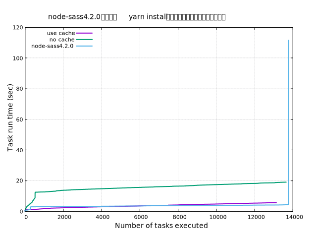

## はじめに

npmもしくはyarnのインストール時間が明らかに遅くなっていく場合があります。
早くする方法としては、まずcacheを有効にすることですが効かないパッケージも存在します。
そのようなパッケージをあぶり出すにはどうしたらよいか、というのが今回のお題です。

npm/yarn系の依存するパッケージ数は大抵の場合、人間が把握しきれない量です。
その中から原因をすぐに特定することは困難であるため、人間か理解できる範囲まで情報を絞り込む必要があります。
今回、インストールのログから情報を精査し、ボトルネックとなっている部分を浮き彫りにする方法を紹介します。

## yarnのcacheの有無を比較する

当サイト（[github - himenon.github.io](https://github.com/Himenon/himenon.github.io)）は`yarn`を利用しているので、
これを題材に話を進めます。

まずはキャッシュの有無でのインストール時間を比較してみます。

### cache dirの設定

```bash
# bash
yarn config set cache-dir $(pwd)/private_cache
# fish shell
yarn config set cache-dir (pwd)/private_cache
```

### 計測用のデータ収集

キャッシュ無しの場合を最初に実行します。

```bash
rm -rf node_modules
yarn --verbose >> data/nocache-install.log
```

一度yarn installを実行すると設置した`cache-dir`にキャッシュが生成されるます。
次にキャッシュ有りの場合を実行します。

```bash
rm -rf node_modules
yarn --verbose >> data/cache-install.log
```

これで2種類のログデータが生成されました。

### ログデータから時間を抽出

ログデータを見て見ると、

```
verbose 1.089 Selecting "@babel/core@7.4.4" 
verbose 1.089 Selecting "@babel/core@7.4.4" 
verbose 1.089 Selecting "react@16.8.6" at l
verbose 1.09 Selecting "react@16.8.6" at l
verbose 1.09 Selecting "typescript@3.4.3" at l
verbose 1.09 Selecting "@babel/core@7.4.4" 
verbose 1.09 Selecting "@babel/core@7.4.4" 
verbose 1.09 Selecting "eslint@5.16.0" at l
```

というようなデータがひたすら並んでいるので、`verbose`でgrepして2列目を抽出すれば時間が収集できます。

```bash
cat data/cache-install.log | grep verbose | awk '{print $2}' > data/cache-install.dat
cat data/nocache-install.log | grep verbose | awk '{print $2}' > data/nocache-install.dat
```

※適当な文字列が混入した場合（エラー時など）は手動で消せばよいです。

### グラフ化

gnuplotでやります。（最近はPythonが流行りっぽいですが、gnuplotで必要十分です）
スプレッドシートでも可能です。ただデータ量が多いので高速に処理するならローカルマシンで動作するようなものが楽でしょう。

```bash
cd data
gnuplot
```

以下のコードを`plot.gp`などのように保存し、`load "plot.gp"`とインタプリタに入力することも可能です。
もちろん、逐次入力して出力を確認することも可能です。

```bash
# フォントサイズの調整
set tics font "Sanserif,11" 
set title font"Sanserif,14"
set xlabel font"Sanserif,14"
set ylabel font"Sanserif1,14"

# 余白の設定
set lmargin 10
set rmargin 10
set tmargin 5
set bmargin 5
set key font ".8"

# 判例の位置
set key left top
# 判例のフォントサイズ
set key font ",11"

# grid表示
set grid

set title "yarn install --frozen-lockfileの実行タスク数と所要時間の推移"
set xlabel "Number of tasks executed"
set ylabel "Task run time (sec)"
# プロットする
plot "cache-install.dat" title "use cache" with line linewidth 2, "nocache-install.dat" title "no cache" with line linewidth 2

```

これを実行すると次のような結果が得られます。


#### gnuplotの参考

* [Gnuplotに関するいろいろメモ](http://www.eng.kagawa-u.ac.jp/~haruna/memo/gnuplot/gnutips.html)
* [gnuplot – キー/凡例の大きさを調整する \- コードログ](https://codeday.me/jp/qa/20190121/169312.html)
* [gnuplotの凡例がグラフと重なる \- コードログ](https://codeday.me/jp/qa/20190121/170005.html)

### 比較・考察

* キャッシュなしの場合は前半10秒弱をネットワーク経由のダウンロードに要する
* ダウンロード後はキャッシュありの場合と同じような遷移をする

## 使い所

実際に遭遇した事例で紹介します。

### node-sass@4.2.0のインストール時間が遅い

`node-sass@4.2.0`のインストールに要する時間をプロットしてみます。



明らかにおかしいですね。
吐き出されたログを調査してみると、以下の場所で時間がかかっていました。

```
verbose 5.348 Downloading binary from https://github.com/sass/node-sass/releases/download/v4.2.0/darwin-x64-64_binding.node
Cannot download "https://github.com/sass/node-sass/releases/download/v4.2.0/darwin-x64-64_binding.node": 

HTTP error 404 Not Found

Hint: If github.com is not accessible in your location
      try setting a proxy via HTTP_PROXY, e.g. 

      export HTTP_PROXY=http://example.com:1234

or configure npm proxy via

      npm config set proxy http://example.com:8080
verbose 111.63 Building: /username/.nodebrew/node/v10.15.3/bin/node
```

node-sass@4.2.0は今回インストールしたマシン用にバイナリが用意されていないため、ソースコードからビルドし直す様になっています。
あまりにも非効率なので、ダウンロード先を切り替えることができないかコードを調査します。
package.jsonの`install`や`postinstall`（参考：<https://docs.npmjs.com/misc/scripts>）あたりからたどっていくと、

```javascript
function getBinaryUrl() {
  var site = getArgument('--sass-binary-site') ||
             process.env.SASS_BINARY_SITE  ||
             process.env.npm_config_sass_binary_site ||
             (pkg.nodeSassConfig && pkg.nodeSassConfig.binarySite) ||
             'https://github.com/sass/node-sass/releases/download';

  return [site, 'v' + pkg.version, getBinaryName()].join('/');
}
```

https://github.com/sass/node-sass/blob/1e76d99164a112a8895c668af795594a35dcdca6/lib/extensions.js#L231-L239

というコードにあたり、環境変数に`SASS_BINARY_SITE`を指定してあげればダウンロードの向き先を変更することができるようです。
`node-sass/vendor/darwin-x64-64/binding.node`というようなディレクトリにバイナリが生成されているので、
ファイル名のパターンだけ気をつけてホスティングすれば、バイナリのビルドではなく、ダウンロードのみになり時間が短縮できます。

## まとめ

* `yarn install`の時間が長い場合に原因を調査するためのプロット方法を紹介した。
* yarnのcacheの時短効果の有効性を可視化した。
* `node-sass@4.2.0`のインストール時間（実質ビルド時間）が長い事例を紹介した。
* JavaScriptのパッケージは芋づる式に大量のパッケージがダウンロードされるため、ボトルネックとなっている部分を「人間がわかるレベル」で調査する方法の一例を示した。
