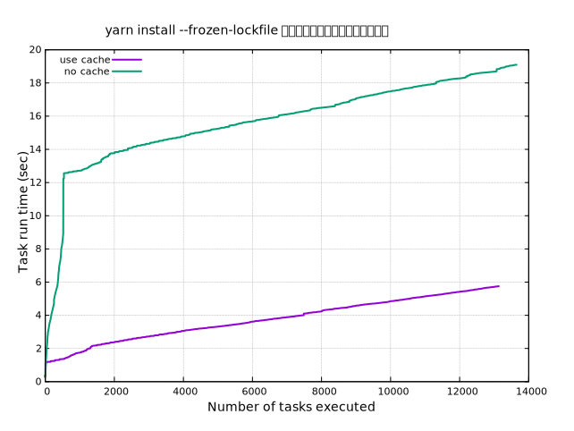

## はじめに

npmもしくはyarnのインストール時間が明らかに遅くなっていく場合があります。
早くする方法としては、まずcacheを有効にすることですが効かないパッケージも存在します。
そのようなパッケージをあぶり出すにはどうしたらよいか、というのが今回のお題です。

npm/yarn系の依存するパッケージ数は大抵の場合、人間が把握しきれない量です。
その中から原因をすぐに特定することは困難であるため、人間か理解できる範囲まで情報を絞り込む必要があります。
今回、インストールのログから情報を精査し、ボトルネックとなっている部分を浮き彫りにする方法を紹介します。

## yarnのcacheありと無しを比較する

### cache dirの設定

```bash
yarn config set cache-dir (pwd)/private_cache
```

### 計測用のデータ収集

キャッシュ無しの場合を最初に実行します

```bash
rm -rf node_modules
yarn --verbose >> data/nocache-install.log
```

一度yarn installを実行するとキャッシュされるので、
次にキャッシュ無し場合を実行します。

```bash
rm -rf node_modules
yarn --verbose >> data/cache-install.log
```

### データ整形

```bash
cat data/cache-install.log | grep verbose | awk '{print $2}' > data/cache-install.dat
cat data/nocache-install.log | grep verbose | awk '{print $2}' > data/nocache-install.dat
```

※適当な文字列は手動で消せばよいです。

### グラフ化

gnuplotでやります。

```bash
cd data
gnuplot
```

gnuplotに読み込ませます。

```bash
# フォントサイズの調整
set tics font "Sanserif,11" 
set title font"Sanserif,14"
set xlabel font"Sanserif,14"
set ylabel font"Sanserif1,14"

# 余白の設定
set lmargin 10
set rmargin 10
set tmargin 5
set bmargin 5
set key font ".8"

# 判例の位置
set key left top
# 判例のフォントサイズ
set key font ",11"

# grid表示
set grid

set title "yarn install --frozen-lockfileのインストール時間の推移"
set xlabel "Installed packages (num)"
set ylabel "Installed total time (sec)"
# プロットする
plot "cache-install.dat" title "use cache" with line linewidth 2, "nocache-install.dat" title "no cache" with line linewidth 2
```



### 参考

* [Gnuplotに関するいろいろメモ](http://www.eng.kagawa-u.ac.jp/~haruna/memo/gnuplot/gnutips.html)
* [gnuplot – キー/凡例の大きさを調整する \- コードログ](https://codeday.me/jp/qa/20190121/169312.html)
* [gnuplotの凡例がグラフと重なる \- コードログ](https://codeday.me/jp/qa/20190121/170005.html)
