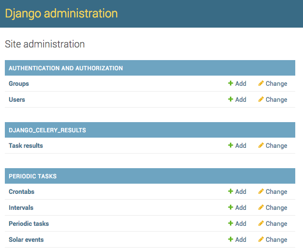
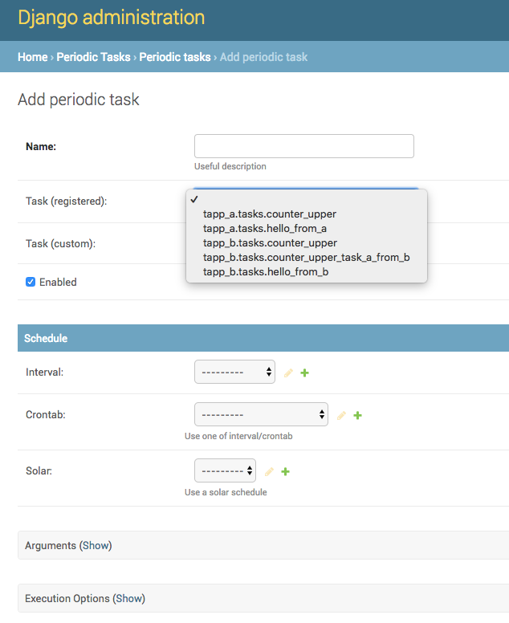
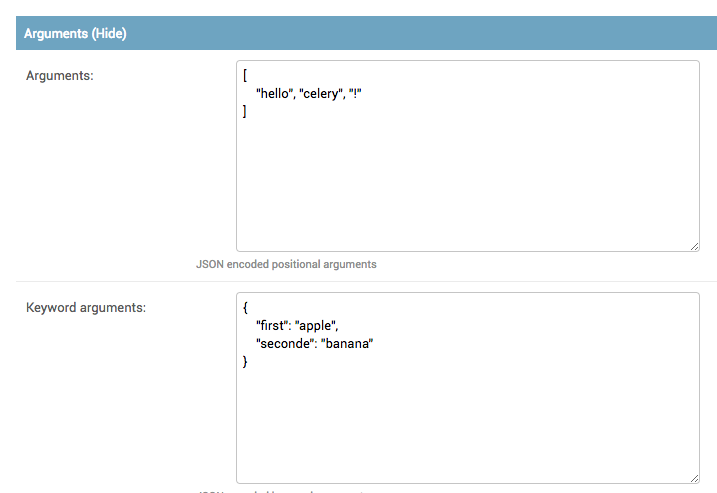

# Django 2.0にCelery 4.0を導入し、WEBの管理画面でCronを管理する

<p id="created_at">作成日: <time dateTime="2018-03-12T01:40">2018/03/12</time></p>

## はじめに

Django 2.0に対して、Celery 4を導入してみたので、その時の知見を書く。
導入自体はそうそう難しくはなかったが、これで動く、といったサンプルコードがなかなか無かったので、
書いておきます。。

[サンプルコード](https://github.com/Himenon/DjangoSample/tree/master/taskmanager_v1)

### 類似技術

類似技術で有名なものとしては

- cookpad/kuroko2: <https://github.com/cookpad/kuroko2>
- RUNDECK: <http://rundeck.org/>

がありますが、実はCeleryとDjagnoでも同じようなことができるので、Pythonやっている人は喜びましょう。

手っ取り早いのは[サンプルコード](https://github.com/Himenon/DjangoSample/tree/master/taskmanager_v1)
をさっさと起動することです。この記事は解説に文字を割いていますので。

## 準備

本サンプルコードは以下の環境で作成した。

```
Django==2.0.3
django-celery-results==1.0.1
django-celery-beat==1.1.1
redis==2.10.6
```

`requirements.txt`に上記を記述し、`pip install -r requirements.txt`でインストールしておく。

## Djangoの作成

1.プロジェクトの作成

```
django-admin startproject tm
```

すると次のようなツリーが作成される。

```
.
├── manage.py
└── tm
    ├── __init__.py
    ├── settings.py
    ├── urls.py
    └── wsgi.py
```

2.Extensionの追加

`tm/settings.py`に次の記述を入れます。

```python
INSTALLED_APPS = [
    'django.contrib.admin',
    'django.contrib.auth',
    'django.contrib.contenttypes',
    'django.contrib.sessions',
    'django.contrib.messages',
    'django.contrib.staticfiles',
    'django_celery_beat',     # 追加
    'django_celery_results',  # 追加
]
```

3.`celery.py`の追加

`tm/`以下に`celery.py`を追加する。
celeryの名前空間を汚染しているが、これであっている。

```
.
├── manage.py
└── tm
    ├── __init__.py
    ├── celery.py     # 追加
    ├── settings.py
    ├── urls.py
    └── wsgi.py
```

`celery.py`は以下のように記述する。


```python
from os import environ
from celery import Celery
app = Celery('tm', broker=environ.get('BROKER_URL'))
app.config_from_object('django.conf:settings', namespace='CELERY')
app.autodiscover_tasks()
```

これは、後々登場する`@task`もしくは`@shared_task`デコレータを、worker起動時に、
自動的に`INSTALLED_APPS`から探索する役割を果たす。

`BROKER_URL`は、環境変数から指定できるようにしてある。これは状況に合わせて変化して欲しい。

4.`__init__.py`にappを読み込むようにする。

`tm/__init__.py`にCeleryを呼び出すコード記述しておく。


```python
from .celery import app as celery_app

__all__ = ['celery_app']
```

5.Migration

CeleryのプラグインはDatabaseへのMigrationを必要とします。

```
python3 manage.py migrate
```

`django-celery-beat`はタスクの実行スケジュール管理のために、
`django-celery-results`は実行五の結果を保存しておくためにDatabaseを利用します。

また、Adminユーザーを作成していない場合は、

```
python3 manage.py createsuperuser
```

でユーザーを作成しておきましょう。
ここまでうまくいくと、次の画像のように管理画面に、タスクのスケジュール管理の画面が出現します。
定期実行タスクの管理がここからできるようになります。



次に、タスクを追加してきます。

## タスクの追加

### アプリの追加

タスクの追加の前に、アプリの追加をしておきましょう。
`manage.py`のあるところで、次のコマンドを叩きます。


```bash
python3 manage.py startapp tapp_a
python3 manage.py startapp tapp_b
```

今回はアプリ同士の相互呼び出しも検証するため、2つのアプリを追加しておきます。
`INSTALLED_APPS`は次のように更新しておきます。

```python
INSTALLED_APPS = [
    'django.contrib.admin',
    'django.contrib.auth',
    'django.contrib.contenttypes',
    'django.contrib.sessions',
    'django.contrib.messages',
    'django.contrib.staticfiles',
    'django_celery_beat',
    'django_celery_results',
    'tapp_a',    # 追加
    'tapp_b',    # 追加
]
```

### タスクの追加

`tapp_a`にシンプルなタスクを追加します。
`tasks.py`というファイルを作成し、次のように記述します。

```python
from celery import shared_task

@shared_task
def hello_from_a(*args, **kwargs):
    print("Hello! From A")
    print("args = {}".format(args))
    print("kwargs = {}".format(kwargs))
```

`@shared_task`を指定すると、Django Adminで認識されます。
画像ではPeriodic Tasksの管理画面中で、いくつかのタスクを追加した場合のものを表示しています。



また、登録したタスクに初期値を与えたい場合は`Arguments`を利用すると可能です。



### 実行タイミングの指定

実行タイミングの指定は、Interval、Crontab、Solarの3つのうち1つのみが選択可能です。
どうしても数種類の実行方法が必要な場合は、別タスクとして登録し直します。

- Interval: 10秒ごとなど。一定間隔で行う
- Crontab: 指定した日時で実行を行う
- Solar: 指定した緯度経度に基づいた、日の出、日没などのタイミングで自動的に実行する

これはお好みで設定して下さい。

ここまで終われば、タスクの登録が完了です。

## タスクの実行

定期実行タスクに関しては、SchedulerとWorker、BrokerをDjangoとは別のプロセスで起動させる必要があります。
[サンプルコード](https://github.com/Himenon/DjangoSample/tree/master/taskmanager_v1)では、
docker-composeを用いて楽をしています。

ただ、ここはそれほど難しものではなく、起動コマンドが異なるだけとなります。
Brokerに関しては今回はredisを採用しており、自動的に立ち上がるので、ここでの説明は省きます。

### scheduler, workerの起動

schedulerの起動コマンドは次の通りです。

```bash
DJANGO_SETTINGS_MODULE=tm.settings celery -A tm beat --scheduler django_celery_beat.schedulers:DatabaseScheduler --pidfile /celerybeat.pid
```

workerの起動コマンドは次のとおりです。

```
bash -c "DJANGO_SETTINGS_MODULE=tm.settings celery -A tm worker"
```

#### 解説

##### workerについて

ここで重要なポイントは`DJANGO_SETTINGS_MODULE=tm.settings`です。
(これを忘れるとひどく沼にはまります。)

`celery -A tm`は`tm/__init__.py`を見に行きます。ここに`celery_app`が存在しない場合はエラーとなります。
次に、`celery.py`の`app.config_from_object`と`app.autodiscover_tasks`においては、
Djangoの`settings.py`を探索しに行きます。

```python
app.config_from_object('django.conf:settings', namespace='CELERY')
```

通常、DEBUGサーバーなど立ち上げる時、`python3 manage.py runserver`などとしますが、
コードを見ると

```python
os.environ.setdefault("DJANGO_SETTINGS_MODULE", "tm.settings")
```

が走っています。つまり、起動時に環境変数を登録しているため、Djangoを利用するceleryも環境変数、もしくは変数を
起動時に定義しておかなければなりません。

タスクの認識に関しては、

```python
app.autodiscover_tasks()
```

が自動的に`settings.py`から`INSTALLED_APPS`を吸ってきて解決してくれるので、それぞれの`APP`で
Workerを明示的に起動する必要はありません。むしろ、それを行った場合、`APP`間でModelを参照するといったことができなくなります。

##### schedulerについて

Schedulerの役割は至ってシンプルです。

1. Databaseに登録されているタスクの監視
2. 指定の時刻になった時、Brokerに対してWorkerがタスクを実行するようにメッセージを送信

1のおかげで、Django Adminでタスクを登録、編集、削除した時に自動的にスケジューリングされます。
2はBrokerへ登録されたタスクを実行するようにメッセージを投げるだけです。
実際に実行されるかどうかは保証されません。

そのスケジュールを管理するためのデータベースとして、
`--scheduler django_celery_beat.schedulers:DatabaseScheduler`を指定しておきます。
未指定の場合は、コマンドの実行ディレクトリにSchedulerの管理用のファイルが作成されます。
`django_celery_beat.schedulers:DatabaseScheduler`を指定してる場合は、
Djando Adminでは見えませんが、Database上にスケジュールが記述され、仮にSchedulerが落ちたとしても、
どのタスクがスケジューリングされているかは残ります。

`--pidfile /celerybeat.pid`としているのは、開発上の都合といえばそのとおりです。
起動場所に`pid`ファイルが生成されますが、Schedulerを再起動した場合に、
`pid`ファイルが存在した場合、Schedulerの多重起動を防ぐためにSchedulerが起動しません。

コンテナを利用している場合は、良くコンテナごと落とすため、これは不便なため、マウントされていなコンテナのディレクトリに`pid`ファイルを投げています。
実際に運用するときは、Schedulerのコンテナのサイズを1のままにしておくのが普通かと思います。

どうしてもSchedulerを冗長化するために複数のコンテナを利用する場合は、各コンテナに永続ボリュームをマウントして、`pid`ファイルが
一意になるように設定しておくこともできますが....

## おわりに

ここまでで、タスクのスケジューリング実行が可能となります。
長くなってしまいそうなので、説明はここまでにしますが、[サンプルコード](https://github.com/Himenon/DjangoSample/tree/master/taskmanager_v1)
ではもうちょっとサンプルを追加しています。興味がある人はぜひご覧ください。


**参考**

- [Periodic Tasks | Celery 4.1.0 documentation](http://docs.celeryproject.org/en/latest/userguide/periodic-tasks.html)


