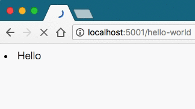

# Flaskのストリーミングを利用してみる

FlaskにStreaming Contentsというものが存在したので、
この実装方法を見てみる。

- <http://flask.pocoo.org/docs/0.12/patterns/streaming/>

## 基本

本記事中では[サンプルコード](https://gist.github.com/Himenon/9a4e7dd1a7e57a6da09b2b9624a737a0)
の一部を使って解説しながら進めていくので、サンプルコードを適宜参照してほしい。

まずは、コードを書いてみる。適当なディレクトリ(ここでは`myapp`)に`server.py`を用意する。

```python
@app.route('/hello-world')
def hello_world():
    def generate():
        for comment in get_comments():
            yield '<li>' + comment + '</li>'
            time.sleep(0.5)  # 動作をわかりやすくするために追加
    return Response(generate())
```

実行すると次のようになった。



手元の環境で確認したところ、ChromeとFirefoxでは動画のような挙動になったが、
Safariはローディングが長くなっただけの、同期的な場合と同じ結果になった。
どうやら、ブラウザごとにローディングの仕組みが異なるようである。

### 何が起きた？

Responseの第一引数(もしくは`response=`)は、StringかIteratorを受け取る。
そこにGeneratorを渡すことによって、ストリーミングすることが可能となる。
これは[PEP333(日本語訳)のBuffering and Streaming](https://knzm.readthedocs.io/en/latest/pep-0333-ja.html#buffering-and-streaming)に次のように決められている。

> しかしながら、大きいファイル、または HTTP ストリーミングの特殊な用途 (複合「サーバプッシュ」など) のために、アプリケーションは出力をより小さ なブロックに提供する必要があるかもしれない (例えばメモリに大きいファイ ルをロードすることを避けるため)。また、応答のある部分を生成するのに時間 がかかる場合も時々あるが、それに先行するレスポンスの部分を前もって送る ことは役に立つだろう。
> これらの場合では、通常、アプリケーションはブロックごとの様式で出力を生 成するイテレータ (しばしばジェネレータ・イテレータ) を返すだろう。これ らのブロックは、 mulitpart 境界 (「サーバプッシュ」のための) や、時間の かかるタスク (ディスクに存在するファイルの別のブロックを読むなど) のす ぐ前で分割が起こるかもしれない。
> 引用：[PEP333(日本語訳)のBuffering and Streaming](https://knzm.readthedocs.io/en/latest/pep-0333-ja.html#buffering-and-streaming)

つまり、
巨大、もしくは大量のデータを送信する時、ストリーミングを利用すれば、サーバー側のメモリーの使用量が押さえられるから、
そのような場合に使うために用意されている。（ただし、トレードオフとして転送時間が同期的なレスポンスの場合よりも長くなる）。

ただし、この仕様はMUSTではないため、他のWSGIミドルウェアが対応していない場合もあるので、注意したほうがよさそう。

## テンプレートを使う

Jinja2のテンプレートを使った場合のストリーミングの実装を見てみる。
まずはテンプレートの用意をする。
Flaskのテンプレートは次のようなディレクトリに配置しておけば良い。
全体のコードは[サンプルコード](https://gist.github.com/Himenon/9a4e7dd1a7e57a6da09b2b9624a737a0)から適宜取得して欲しい。

```
myapp/
├── server.py
└── templates
    └── comment_list.html  # 追加
```

まずは、<http://flask.pocoo.org/docs/0.12/patterns/streaming/>に書いてあるコードを真似してみる。

```python
def stream_template(template_name, **context):
    app.update_template_context(context)
    t = app.jinja_env.get_template(template_name)   # jinja2.Template
    rv = t.stream(context)                          # jinja2.environment.TemplateStream 
    rv.enable_buffering(5)
    return rv

@app.route('/hello-world-with-template')
def hello_world_with_template():
    return Response(stream_template('comment_list.html', comments=get_comments()))
```

`/hello-world-with-template`にアクセスすれば、レンダリングされていることが分かる。
が、`time.sleep`を入れる場所がないのでもう少し深ぼってみる

### jinja2.Templateの挙動を確認する

テンプレートエンジンはJinja2を利用するため、読むべきAPIドキュメントはJinja2の方。

- http://jinja.pocoo.org/docs/2.10/api/#jinja2.Template

`jinja2.environment.TemplateStream`の挙動を検証する。
`templates`が存在する、`myapp/`の中でipythonを叩いてみる。

```python
from flask import Flask
app = Flask('hello')

context = {
    'comments': [ 'Count: {}'.format(i) for i in range(100) ]
}
app.update_template_context(context)
t = app.jinja_env.get_template('comment_list.html')

rv = t.stream(context) # jinja2.environment.TemplateStream
rv.enable_buffering(5) # バッファサイズ

next(rv) # listの1〜5  まで
next(rv) # listの6〜11 まで
# ...
```

`jinja2.environment.TemplateStream`は`enable_buffering`で指定された
大きさにチャンクされたイテレータ化されてくる（`__iter__`を持っている)。

これを逆手に取って、どの様にレンダリングされていくか、確認するため似、次のようにコードを書き換えてみる。

```python
def stream_template(template_name, **context):
    app.update_template_context(context)
    t = app.jinja_env.get_template(template_name)
    rv = t.stream(context)
    rv.enable_buffering(5)
    for buffer in rv:
        yield buffer
        time.sleep(0.5)
```

これを実行すると、次のような結果になった。


やはりResponseにイテレータを渡していることがわかった。

## stream_with_context

Generatorの中でリクエストに含まれるパラメータを取得したい場合がある。
generator中では`flask.requrest`にアクセスできないため、それを可能にするために、
`stream_with_context`を利用する。これを利用することにより、
`flask.request`にアクセスすることができる。

```python
@app.route('/stream')
def streamed_response():
    def generate():
        yield 'Hello '
        time.sleep(1)
        yield request.args['name'] # stream_with_contextでwrapされてるためアクセウ可
        time.sleep(1)
        yield '!'

    return Response(stream_with_context(generate()))
```

## 所感

PEP333に書いてあるとおり、データ容量の大きなデータを送信する場合に使えることがわかる。
数MB、もしくは数GB単位のデータをウェブサイトからダウンロードする時、サーバー側に負荷をかけないためにも
このパターンは使えそうである。

**参考**

本文中で出てきたリンクをまとめておく。

- サンプルコード: <https://gist.github.com/Himenon/9a4e7dd1a7e57a6da09b2b9624a737a0>
- Flask Streaming Content: <http://flask.pocoo.org/docs/0.12/patterns/streaming/>
- PEP333: <https://knzm.readthedocs.io/en/latest/pep-0333-ja.html#buffering-and-streaming>
- Jinja2: <http://jinja.pocoo.org/docs/2.10/api/#jinja2.Template>


