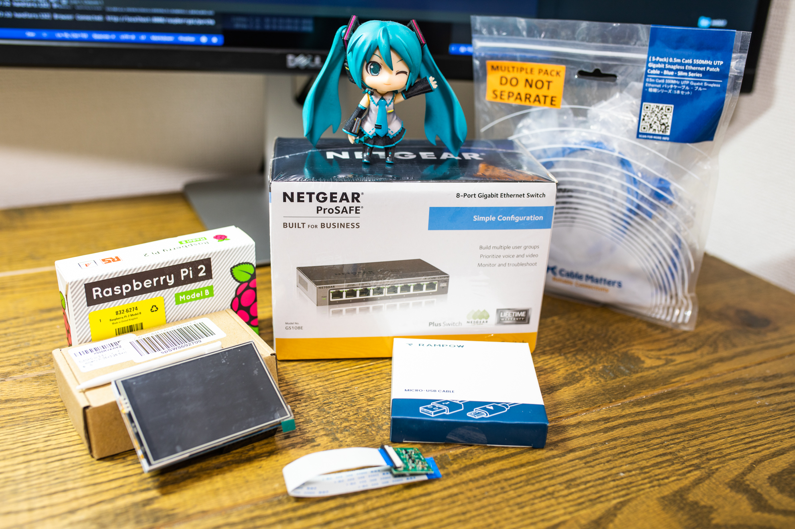

家にRaspberry Pi 2 Model Bが2年ほど眠っていたので、それを利用するために周辺部品を買った。

## パーツ一覧

|  品名 | 価格 | 数量 |
|  ------ | ------ | ------ |
|  Samsung microSDカード32GB | 1080 | 1 |
|  NETGEAR スイッチングハブ ギガビット8ポート | 4672 | 1 |
|  【2本組】Rampow Micro USBケーブル | 799 | 1 |
|  ELECROW 3.5インチTFT LCD ディスプレイ | 2499 | 1 |
|  ラズパイ用 高画質 カメラモジュール - Camera Module for Raspberry Pi | 1680 | 1 |
|  Cable Matters Cat6 Snagless Ethernet パッチケーブル/LANケーブル 0.5m - 極細シリーズ（5本セット） | 1000 | 1 |
|  Raspberry Pi 2 Model B | 6280 | 1 |
|  合計 | 18010 | 7 |

※ 写真のミクはついてきません。

遊ぶぞー。
